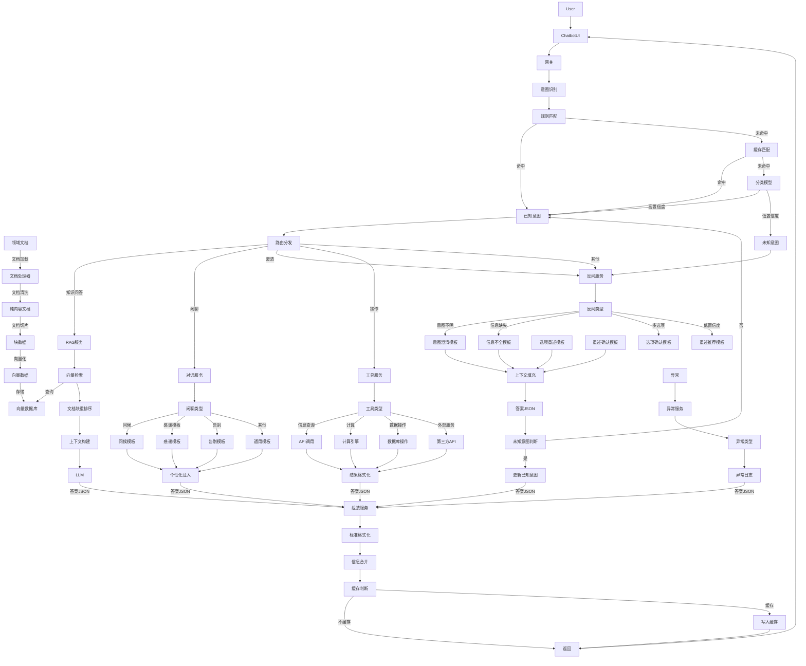
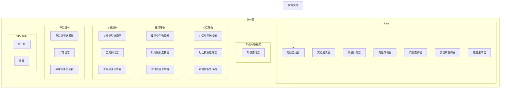
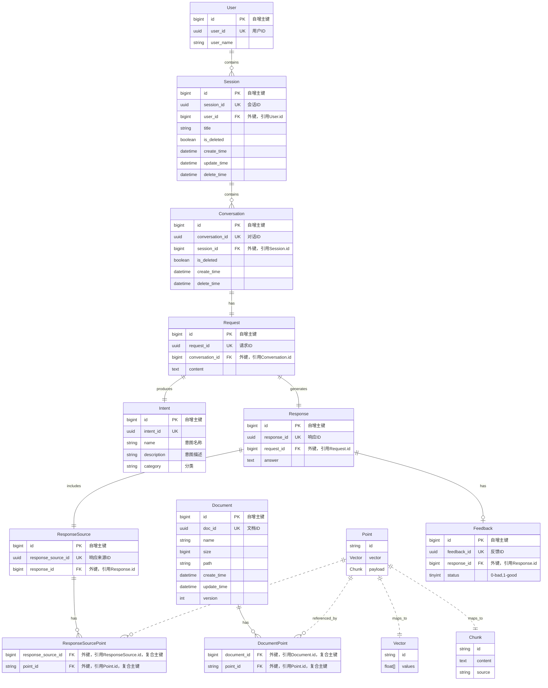
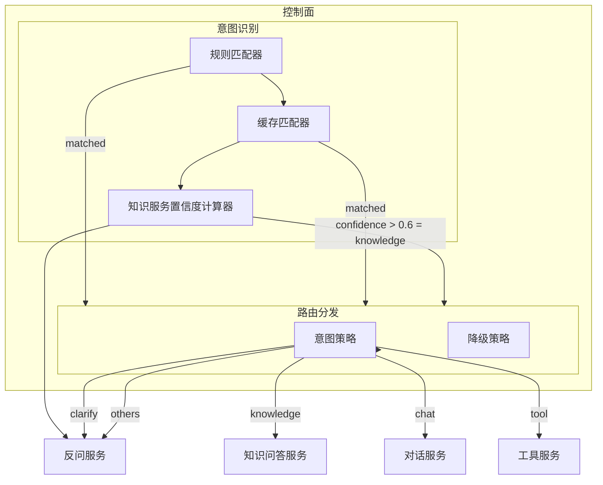

# General RAG

## Business Workflow

## Business Plane

## Data Plane

## Control Plane

## Technical Solution

### Framework Layer (Structural Core)

- **Python Version**: 3.12
- **Dependency Management**: `UV` - Package management and virtual environment
- **Embedding Framework**: `sentence-transformers` - Unified embedding and similarity calculation
- **Web Framework**: `FastAPI` - API service
- **Configuration Management**: `YAML` + `Pydantic` - Configuration-driven approach
- **Service Communication**: `HTTP/REST` + `OpenAI-compatible API` - Inter-service communication
- **Chatbot Framework**: LangChain - ChatPromptTemplate/PydanticOutputParser/BaseCallbackHandler/LCEL
- **Document Framework**: LlamaIndex - SimpleDirectoryReader/SemanticSplitterNodeParser/HuggingFaceEmbedding

### Model Layer (AI Capabilities)

- **Embedding Model**: `BAAI/bge-small-zh-v1.5` - Chinese, 33MB, local CPU
- **Intent Classification Model**: `BAAI/bge-small-zh-v1.5` + Template Matching
- **Primary LLM**: `DeepSeek API` - Answer generation, low cost
- **Fallback LLM**: `llama.cpp` + `Qwen2.5-1.5B` - Local fallback option

### Storage Layer (Data Persistence)

- **Vector Database**: `Qdrant` - Vector + original text storage and retrieval
- **Relational Database**: `PostgreSQL` - Session/request/response storage
- **Cache**: `Redis` - Session state/response caching
- **Object Storage**: `MinIO` / File system - Raw document storage
- **Logger**: loguru - Local/Docker driven logger

### Deployment Layer (Runtime Environment)

- **Development Environment**: Linux with CPU
- **Containerization**: `Docker` + `Docker Compose` - Service packaging
- **Orchestration**: `Kubernetes` (optional) - Production scaling
