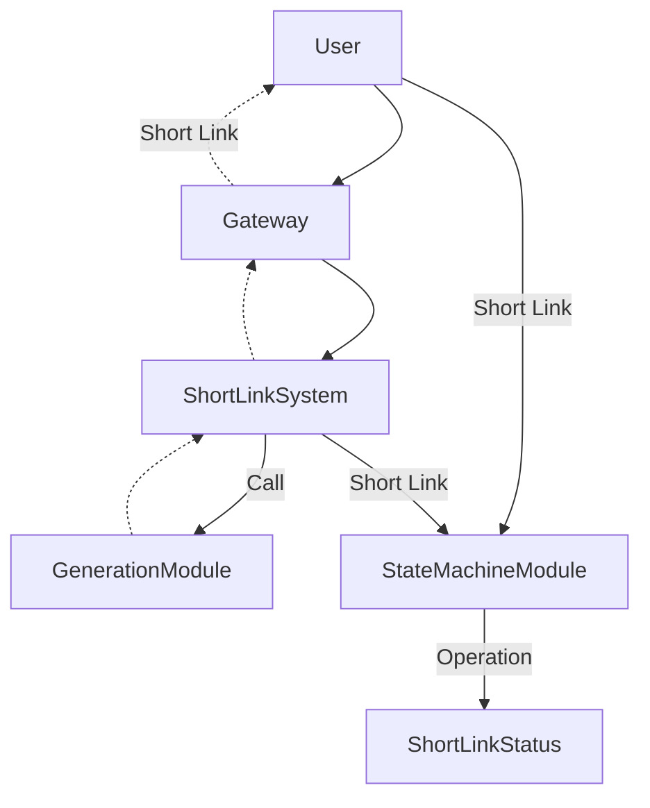
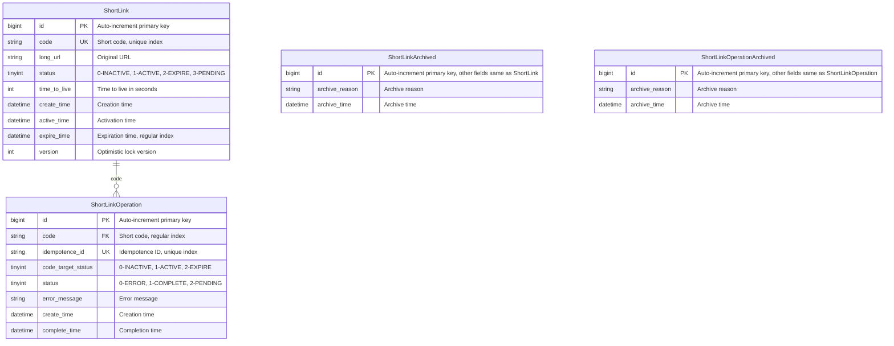
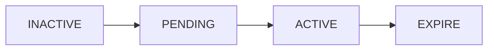
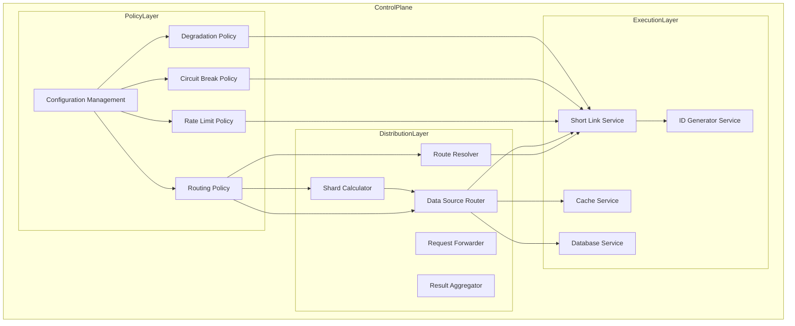

# Short Link System Design

## Overview

A scalable URL shortening service designed for high availability, performance, and reliability. The system converts long URLs into short, memorable links while providing comprehensive management, monitoring, and analytics capabilities.

## System Architecture

### Business Layer

**Key Components:**
- **Gateway**: Entry point for all user requests
- **Short Link System**: Core service handling URL shortening operations
- **Generation Module**: Responsible for creating unique short codes
- **State Machine Module**: Manages short link lifecycle and state transitions

## Data Design

### Data Models

### State Machine

**State Transitions:**
- **INACTIVE**: Initial state after creation
- **PENDING**: Awaiting activation
- **ACTIVE**: Available for redirection
- **EXPIRE**: Expired and no longer accessible

### Data Lifecycle Management

**Daily Maintenance Schedule:**
1. **03:00**: Archive operation records older than 90 days
2. **04:00**: Archive expired short codes older than 30 days
3. **05:00**: Delete operation records older than 90 days
4. **06:00**: Delete expired short codes older than 30 days
5. **07:00**: Invalidate PENDING status short codes

### Database Sharding Strategy

**Sharding Configuration:**
- **Number of Shards**: 256
- **Sharding Algorithm**: Consistent Hashing
- **Purpose**: Horizontal scaling and load distribution

## Control Plane

### Routing Strategy

- **Sharding Strategy**: Based on consistent hashing across 256 shards
- **Read-Write Separation**: Separate read and write operations for better performance
- **Dynamic Routing**: Adaptive routing based on system load and health

### Degradation Strategy

- **Functional Degradation**: Gracefully disable non-essential features under high load
- **Cache Degradation**: Fallback mechanisms when cache services are unavailable
- **Data Degradation**: Serve stale data when fresh data is unavailable

### Rate Limiting Strategy (Resilience4j/Bucket4j)

- **API Rate Limiting**: Per-endpoint request limits
- **User Rate Limiting**: Per-user request limits
- **Distributed Rate Limiting**: Bucket4j + Redis for distributed coordination

### Circuit Breaking Strategy (Resilience4j)

- **Redis Circuit Breaker**: Protect against Redis service failures
- **Database Circuit Breaker**: Protect against database service failures
- **ID Generator Circuit Breaker**: Protect against ID generation service failures

### Configuration Management

- **Dynamic Configuration**: Runtime configuration updates without restart
- **Gray Release Configuration**: Gradual rollout of configuration changes
- **Local Configuration**: Primary configuration stored locally with fallback mechanisms

## Infrastructure & Deployment

> Reference Kubernetes deployment configuration for detailed infrastructure setup.

**Key Infrastructure Components:**
- Container orchestration via Kubernetes
- Service mesh for inter-service communication
- Load balancing and service discovery
- Auto-scaling based on metrics

## Security

> Reference Kubernetes security configuration for detailed security measures.

**Security Considerations:**
- Network security policies
- Secret management
- Authentication and authorization
- Audit logging
- DDoS protection

## Monitoring & Observability

> Reference Kubernetes monitoring configuration for detailed observability setup.

**Monitoring Stack:**
- **Metrics**: Actuator + Micrometer for application metrics
- **Logging**: ELK stack (Elasticsearch, Logstash, Kibana) for centralized logging
- **Alerting**: AlertManager for notification and alert management
- **Tracing**: Distributed tracing for request flow analysis

## Technology Stack

| Category | Technology | Version/Purpose |
|----------|------------|-----------------|
| **Language** | Java | 21 |
| **Framework** | Spring Boot | 4.x |
| **Web Layer** | Spring MVC | REST API implementation |
| **Validation** | Spring Validation | Request parameter validation |
| **Build Tool** | Gradle | Dependency management and build |
| **Code Simplification** | Lombok | Reduce boilerplate code |
| **Object Mapping** | MapStruct | DTO to entity mapping |
| **Utility Library** | Hutool | Common utility functions |
| **Connection Pool** | HikariCP | Database connection pooling |
| **Database** | PostgreSQL | Primary relational database |
| **Development DB** | H2 Database | In-memory database for development |
| **ORM** | MyBatis-Plus | Database access and mapping |
| **Redis Client** | Lettuce + Redisson | Redis connectivity and distributed locks |
| **Local Cache** | Caffeine | In-memory caching |
| **Database Sharding** | ShardingSphere-JDBC | Database sharding and read-write separation |
| **Rate Limiting** | Resilience4j | Circuit breaking and rate limiting |
| **Distributed Rate Limiting** | Bucket4j + Redis | Distributed rate limiting coordination |
| **ID Generation** | Snowflake Algorithm | Distributed unique ID generation |
| **Configuration Center** | Local Configuration | Configuration management |
| **Metrics** | Actuator + Micrometer | Application metrics collection |
| **Logging** | ELK Stack | Centralized logging (Elasticsearch, Logstash, Kibana) |
| **Alerting** | AlertManager | Alert notification and management |

## System Characteristics

### Scalability
- Horizontal scaling through database sharding
- Stateless service design for easy replication
- Caching layers to reduce database load

### Reliability
- Comprehensive error handling and retry mechanisms
- Circuit breaking to prevent cascading failures
- Data redundancy and backup strategies

### Performance
- Multi-level caching (Redis + Caffeine)
- Database query optimization
- Asynchronous processing where applicable

### Maintainability
- Clear separation of concerns
- Comprehensive monitoring and logging
- Automated maintenance tasks