# 租户系统设计报告

## 一、MDD 七平面架构总览

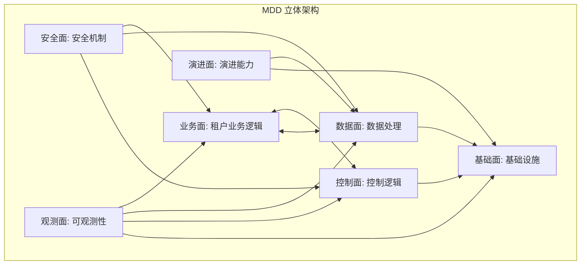
```mermaid
flowchart TB
  subgraph MDD["MDD 立体架构"]
    BIZ["业务面: 租户业务逻辑"]
    DATA["数据面: 数据处理"]
    CTRL["控制面: 控制逻辑"]
    BASE["基础面: 基础设施"]
    OBS["观测面: 可观测性"]
    SEC["安全面: 安全机制"]
    EVOL["演进面: 演进能力"]
  end

  BIZ <--> CTRL
  BIZ <--> DATA
  DATA --> BASE
  CTRL --> BASE
  SEC --> BIZ
  SEC --> DATA
  SEC --> CTRL
  OBS --> BIZ
  OBS --> DATA
  OBS --> CTRL
  OBS --> BASE
  EVOL --> DATA
  EVOL --> BASE
```

### 平面之间的层次关系与交互网络

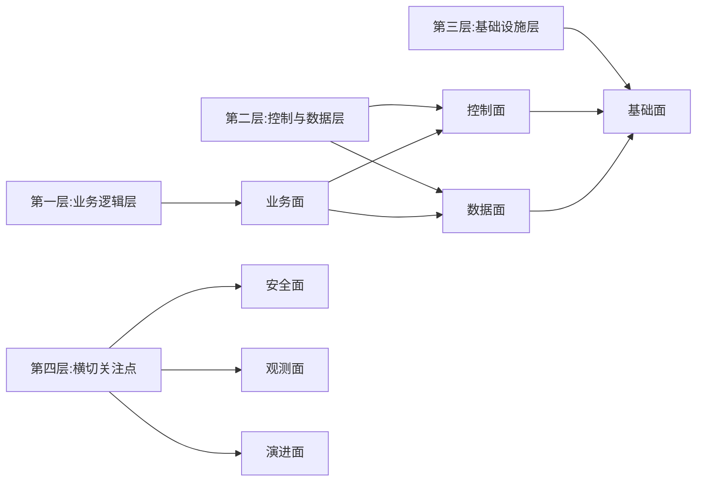
```mermaid
flowchart LR
  L1["第一层:业务逻辑层"]
  L2["第二层:控制与数据层"]
  L3["第三层:基础设施层"]
  L4["第四层:横切关注点"]

  BIZ["业务面"]
  CTRL["控制面"]
  DATA["数据面"]
  BASE["基础面"]
  SEC["安全面"]
  OBS["观测面"]
  EVOL["演进面"]

  L1 --> BIZ
  L2 --> CTRL
  L2 --> DATA
  L3 --> BASE
  L4 --> SEC
  L4 --> OBS
  L4 --> EVOL

  BIZ --> CTRL
  BIZ --> DATA
  CTRL --> BASE
  DATA --> BASE
```

---

## 二、业务面:租户业务逻辑

### 2.1 业务实体模型

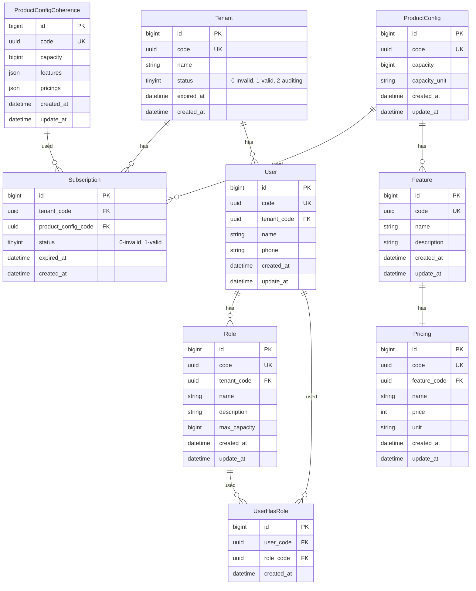
```mermaid
erDiagram
  Tenant {
    bigint id PK
    uuid code UK
    string name
    tinyint status "0-invalid, 1-valid, 2-auditing"
    datetime expired_at
    datetime created_at
  }

  Subscription {
    bigint id PK
    uuid tenant_code FK
    uuid product_config_code FK
    tinyint status "0-invalid, 1-valid"
    datetime expired_at
    datetime created_at
  }

  ProductConfigCoherence {
    bigint id PK
    uuid code UK
    bigint capacity
    json features
    json pricings
    datetime created_at
    datetime update_at
  }

  ProductConfig {
    bigint id PK
    uuid code UK
    bigint capacity
    string capacity_unit
    datetime created_at
    datetime update_at
  }
  
  Feature {
    bigint id PK
    uuid code UK
    string name
    string description
    datetime created_at
    datetime update_at
  }

  Pricing {
    bigint id PK
    uuid code UK
    uuid feature_code FK
    string name
    int price
    string unit
    datetime created_at
    datetime update_at
  }

  User {
    bigint id PK
    uuid code UK
    uuid tenant_code FK
    string name
    string phone
    datetime created_at
    datetime update_at
  }

  Role {
    bigint id PK
    uuid code UK
    uuid tenant_code FK
    string name
    string description
    bigint max_capacity
    datetime created_at
    datetime update_at
  }
  
  UserHasRole {
    bigint id PK
    uuid user_code FK
    uuid role_code FK
    datetime created_at
  }

  Tenant ||--o{ Subscription : has
  ProductConfigCoherence ||--o{ Subscription : used
  ProductConfig ||--o{ Subscription : used
  ProductConfig ||--o{ Feature : has
  Feature ||--|| Pricing : has
  Tenant ||--o{ User : has
  User ||--o{ Role : has
  User ||--o{ UserHasRole : used
  Role ||--o{ UserHasRole : used

```

#### 容量所有权原则 (Capacity Ownership Principle)

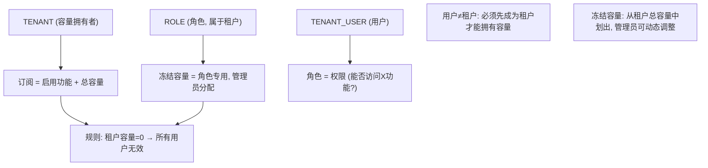
```mermaid
flowchart TB
  TENANT["TENANT (容量拥有者)"]
  T1["订阅 = 启用功能 + 总容量"]

  ROLE["ROLE (角色, 属于租户)"]
  R1["冻结容量 = 角色专用, 管理员分配"]

  USER["TENANT_USER (用户)"]
  U1["角色 = 权限 (能否访问X功能?)"]

  RULE1["规则: 租户容量=0 → 所有用户无效"]
  RULE2["用户≠租户: 必须先成为租户才能拥有容量"]
  RULE3["冻结容量: 从租户总容量中划出, 管理员可动态调整"]

  TENANT --> T1
  ROLE --> R1
  USER --> U1
  T1 --> RULE1
  R1 --> RULE1
```

**核心规则**: 租户是容量的唯一所有者

#### 容量计算公式 (Capacity Resolution)

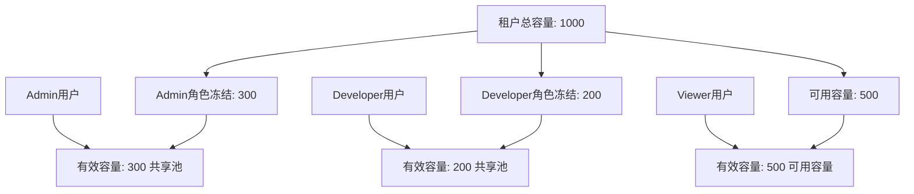
```mermaid
flowchart TB
  Total["租户总容量: 1000"]

  F1["Admin角色冻结: 300"]
  F2["Developer角色冻结: 200"]
  Avail["可用容量: 500"]

  Total --> F1
  Total --> F2
  Total --> Avail

  U1["Admin用户"] --> U1C["有效容量: 300 共享池"]
  U2["Developer用户"] --> U2C["有效容量: 200 共享池"]
  U3["Viewer用户"] --> U3C["有效容量: 500 可用容量"]

  F1 --> U1C
  F2 --> U2C
  Avail --> U3C
```

**边界情况**:
- 租户总容量 = 0 → 所有用户无效
- 冻结容量总和 ≤ 租户总容量
- 管理员可随时调整冻结容量
- 同角色用户共享冻结容量池


### 2.2 业务核心流程

#### 2.2.1 租户生命周期

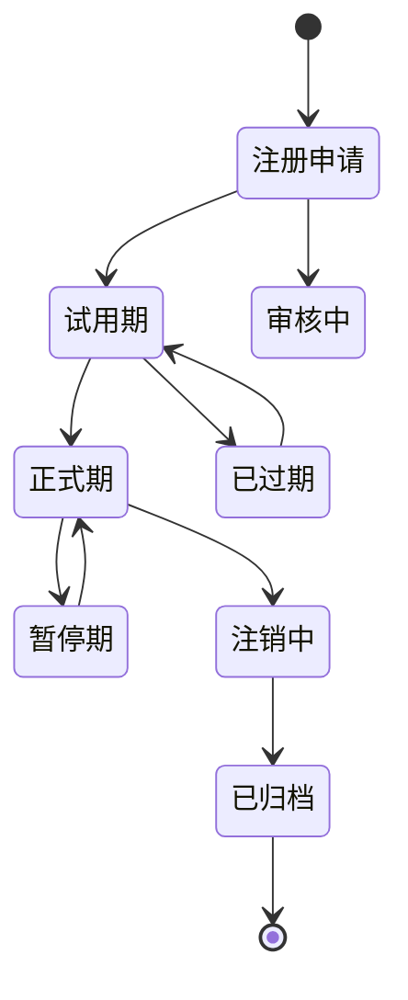
```mermaid
stateDiagram-v2
  [*] --> 注册申请

  注册申请 --> 试用期
  注册申请 --> 审核中

  试用期 --> 正式期
  试用期 --> 已过期
  已过期 --> 试用期

  正式期 --> 暂停期
  暂停期 --> 正式期

  正式期 --> 注销中
  注销中 --> 已归档
  已归档 --> [*]
```

#### 2.2.2 订阅与容量管理流程

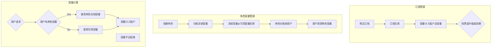
```mermaid
flowchart TB
  subgraph S1["订阅管理"]
    A1[购买订阅]
    A2[订阅生效]
    A3[容量计入租户总容量]
    A4{续费或升级或到期}
  end

  subgraph S2["角色容量管理"]
    B1[创建角色]
    B2[分配冻结容量]
    B3[冻结容量从可用容量扣除]
    B4[角色分配给用户]
    B5[用户获得角色容量]
  end

  subgraph S3["容量计算"]
    C1{用户请求}
    C2{用户有角色容量}
    C3[使用角色冻结容量]
    C4[使用可用容量]
    C5[用量计入租户]
    C6[容量不足拒绝]
  end

  A1 --> A2
  A2 --> A3
  A3 --> A4

  B1 --> B2
  B2 --> B3
  B3 --> B4
  B4 --> B5

  C1 --> C2
  C2 -->|Yes| C3
  C2 -->|No| C4
  C3 --> C5
  C4 --> C5
```

#### 2.2.3 容量状态流转

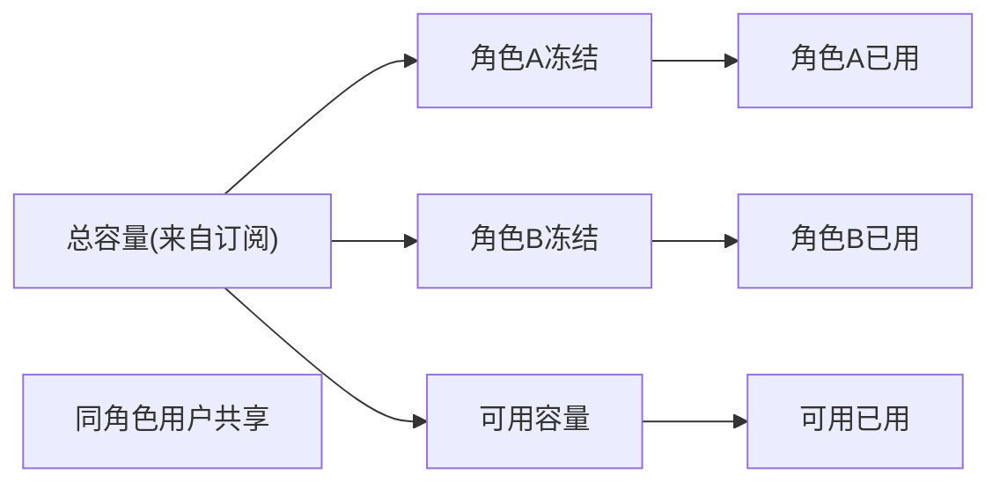
```mermaid
flowchart LR
  T1["总容量(来自订阅)"]
  A1["角色A冻结"]
  A2["角色B冻结"]
  A3["可用容量"]
  C1["角色A已用"]
  C2["角色B已用"]
  C3["可用已用"]
  Note1["同角色用户共享"]

  T1 --> A1
  T1 --> A2
  T1 --> A3

  A1 --> C1
  A2 --> C2
  A3 --> C3
```

### 2.3 业务面与其他平面的交互

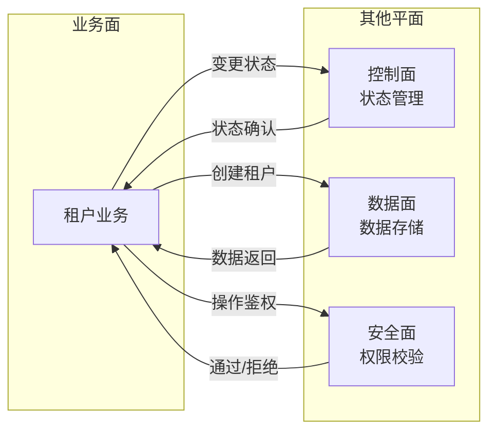
```mermaid
flowchart LR
  subgraph "业务面"
    BIZ[租户业务]
  end

  subgraph "其他平面"
    CTRL[控制面<br/>状态管理]
    DATA[数据面<br/>数据存储]
    SEC[安全面<br/>权限校验]
  end

  BIZ -->|创建租户| DATA
  BIZ -->|变更状态| CTRL
  BIZ -->|操作鉴权| SEC
  SEC -->|通过/拒绝| BIZ
  DATA -->|数据返回| BIZ
  CTRL -->|状态确认| BIZ
```

---

## 三、数据面:数据处理

### 3.1 数据隔离架构

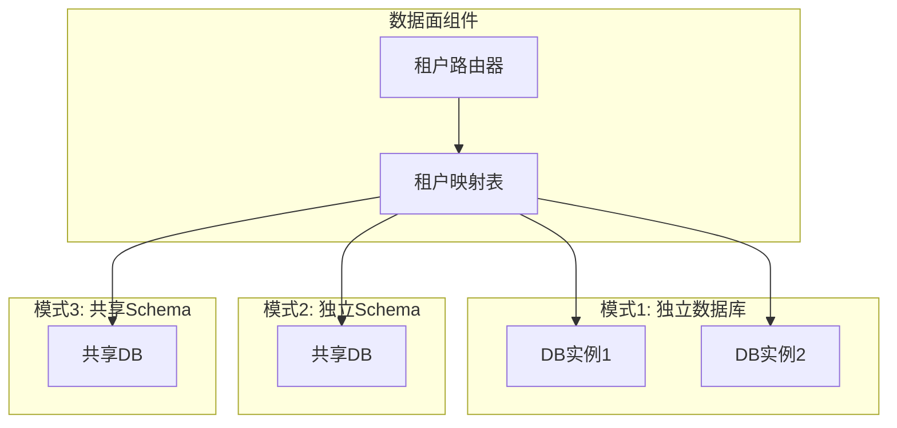
```mermaid
flowchart TB
  subgraph C1["数据面组件"]
    Router["租户路由器"]
    Mapping["租户映射表"]
  end

  subgraph M1["模式1: 独立数据库"]
    DB1["DB实例1"]
    DB2["DB实例2"]
  end

  subgraph M2["模式2: 独立Schema"]
    SchemaDB["共享DB"]
  end

  subgraph M3["模式3: 共享Schema"]
    SharedDB["共享DB"]
  end

  Router --> Mapping
  Mapping --> DB1
  Mapping --> DB2
  Mapping --> SchemaDB
  Mapping --> SharedDB
```

### 3.2 数据路由机制

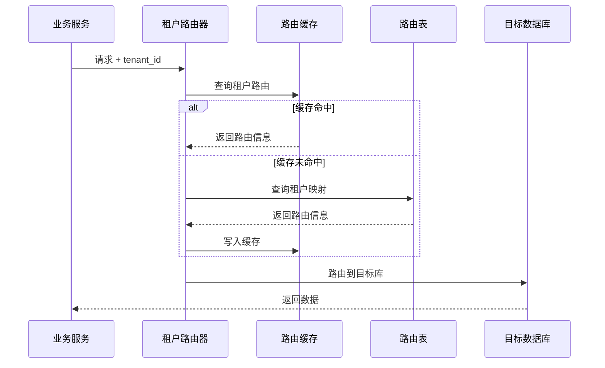
```mermaid
sequenceDiagram
  participant App as 业务服务
  participant Router as 租户路由器
  participant Cache as 路由缓存
  participant DB as 路由表
  participant Target as 目标数据库

  App->>Router: 请求 + tenant_id
  Router->>Cache: 查询租户路由
  alt 缓存命中
    Cache-->>Router: 返回路由信息
  else 缓存未命中
    Router->>DB: 查询租户映射
    DB-->>Router: 返回路由信息
    Router->>Cache: 写入缓存
  end
  Router->>Target: 路由到目标库
  Target-->>App: 返回数据
```

### 3.3 动态字段扩展

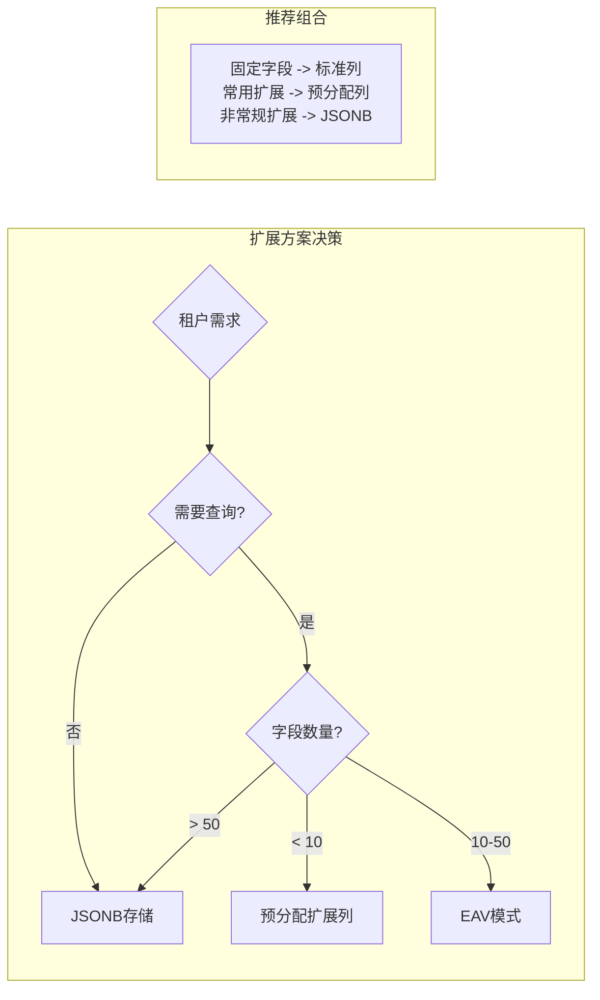
```mermaid
flowchart LR
  subgraph "扩展方案决策"
    Start{租户需求} --> Q1{需要查询?}
    Q1 -->|是| Q2{字段数量?}
    Q1 -->|否| JSONB[JSONB存储]

    Q2 -->|< 10| PreCol[预分配扩展列]
    Q2 -->|10-50| EAV[EAV模式]
    Q2 -->|> 50| JSONB
  end

  subgraph "推荐组合"
    Rec[固定字段 -> 标准列<br>常用扩展 -> 预分配列<br>非常规扩展 -> JSONB]
  end
```

---

## 四、控制面:控制逻辑

### 4.1 租户状态控制器

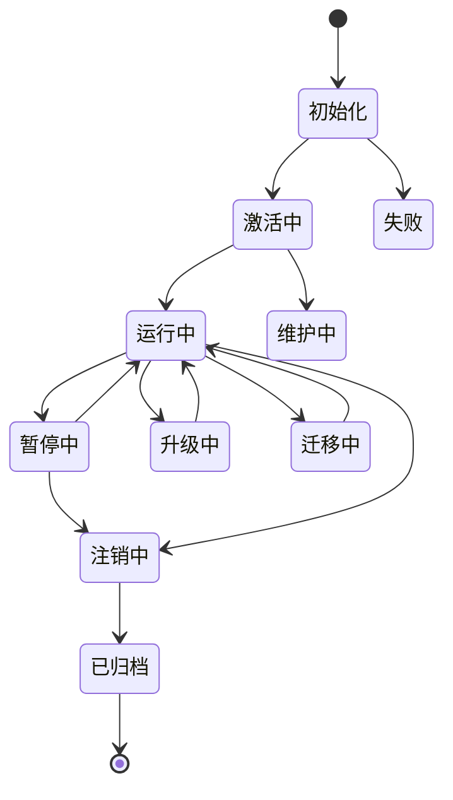
```mermaid
stateDiagram-v2
  [*] --> 初始化

  初始化 --> 激活中
  初始化 --> 失败

  激活中 --> 运行中
  激活中 --> 维护中

  运行中 --> 暂停中
  暂停中 --> 运行中
  暂停中 --> 注销中

  运行中 --> 升级中
  升级中 --> 运行中

  运行中 --> 迁移中
  迁移中 --> 运行中

  运行中 --> 注销中
  注销中 --> 已归档

  已归档 --> [*]
```

### 4.2 容量控制循环

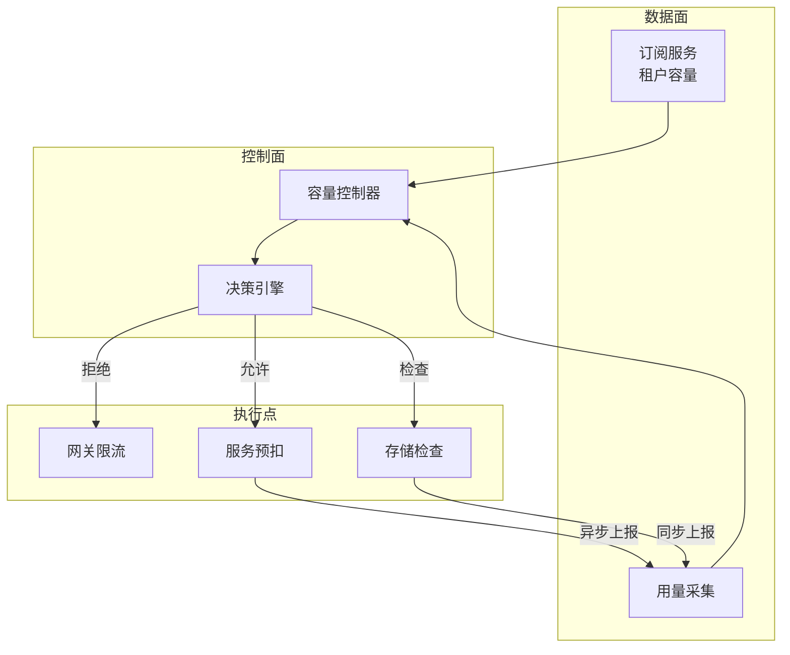
```mermaid
flowchart TB
  subgraph "控制面"
    Controller[容量控制器]
    Decision[决策引擎]
  end

  subgraph "数据面"
    Usage[用量采集]
    Subscription[订阅服务<br/>租户容量]
  end

  subgraph "执行点"
    Gateway[网关限流]
    Service[服务预扣]
    Storage[存储检查]
  end

  Usage --> Controller
  Subscription --> Controller
  Controller --> Decision

  Decision -->|拒绝| Gateway
  Decision -->|允许| Service
  Decision -->|检查| Storage

  Service -->|异步上报| Usage
  Storage -->|同步上报| Usage
```

#### 容量控制执行流程

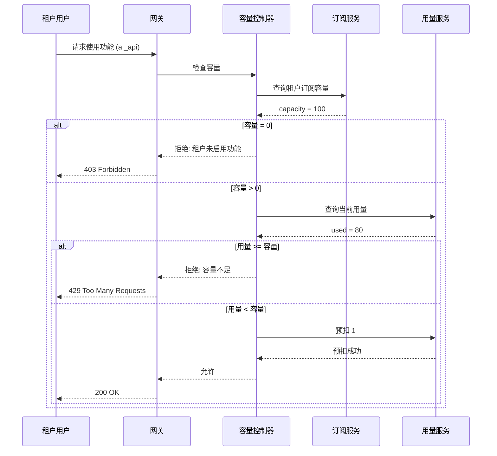
```mermaid
sequenceDiagram
  participant User as 租户用户
  participant GW as 网关
  participant Ctrl as 容量控制器
  participant Sub as 订阅服务
  participant Usage as 用量服务

  User->>GW: 请求使用功能 (ai_api)
  GW->>Ctrl: 检查容量

  Ctrl->>Sub: 查询租户订阅容量
  Sub-->>Ctrl: capacity = 100

  alt 容量 = 0
    Ctrl-->>GW: 拒绝: 租户未启用功能
    GW-->>User: 403 Forbidden
  else 容量 > 0
    Ctrl->>Usage: 查询当前用量
    Usage-->>Ctrl: used = 80

    alt 用量 >= 容量
      Ctrl-->>GW: 拒绝: 容量不足
      GW-->>User: 429 Too Many Requests
    else 用量 < 容量
      Ctrl->>Usage: 预扣 1
      Usage-->>Ctrl: 预扣成功
      Ctrl-->>GW: 允许
      GW-->>User: 200 OK
    end
  end
```

### 4.3 控制面状态机

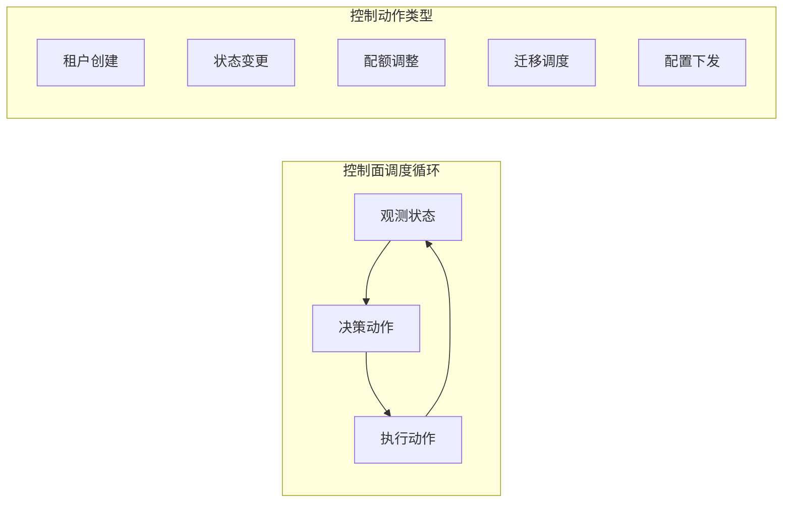
```mermaid
flowchart LR
  subgraph "控制面调度循环"
    Observe[观测状态] --> Decide[决策动作]
    Decide --> Act[执行动作]
    Act --> Observe
  end

  subgraph "控制动作类型"
    A1[租户创建]
    A2[状态变更]
    A3[配额调整]
    A4[迁移调度]
    A5[配置下发]
  end
```

---

## 五、基础面:基础设施

### 5.1 基础设施架构

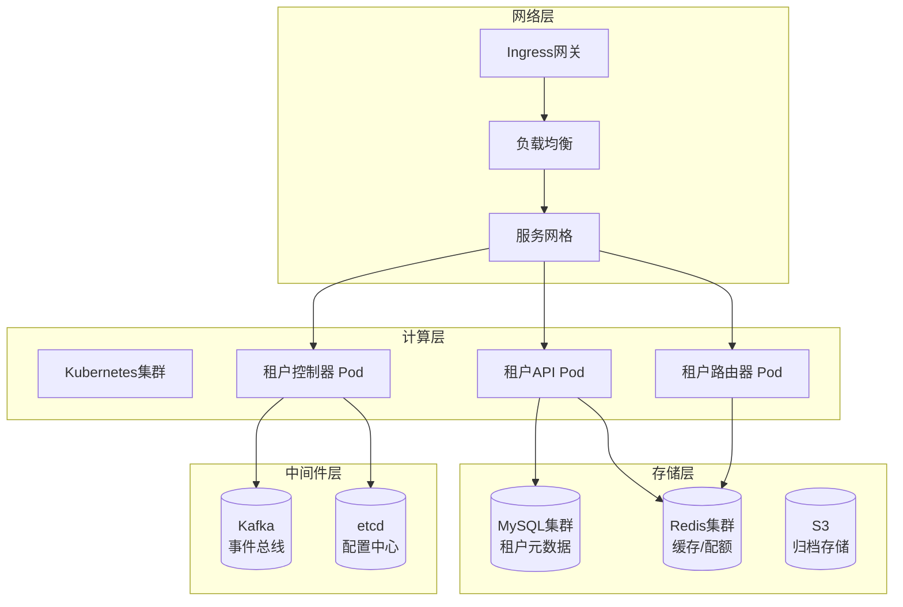
```mermaid
flowchart TB
  subgraph "计算层"
    K8s[Kubernetes集群]
    Pod1[租户API Pod]
    Pod2[租户控制器 Pod]
    Pod3[租户路由器 Pod]
  end

  subgraph "网络层"
    Ingress[Ingress网关]
    LB[负载均衡]
    ServiceMesh[服务网格]
  end

  subgraph "存储层"
    MySQL[(MySQL集群<br/>租户元数据)]
    Redis[(Redis集群<br/>缓存/配额)]
    S3[(S3<br/>归档存储)]
  end

  subgraph "中间件层"
    Kafka[(Kafka<br/>事件总线)]
    ETCD[(etcd<br/>配置中心)]
  end

  Ingress --> LB
  LB --> ServiceMesh
  ServiceMesh --> Pod1
  ServiceMesh --> Pod2
  ServiceMesh --> Pod3

  Pod1 --> MySQL
  Pod1 --> Redis
  Pod2 --> Kafka
  Pod2 --> ETCD
  Pod3 --> Redis
```

### 5.2 租户资源池

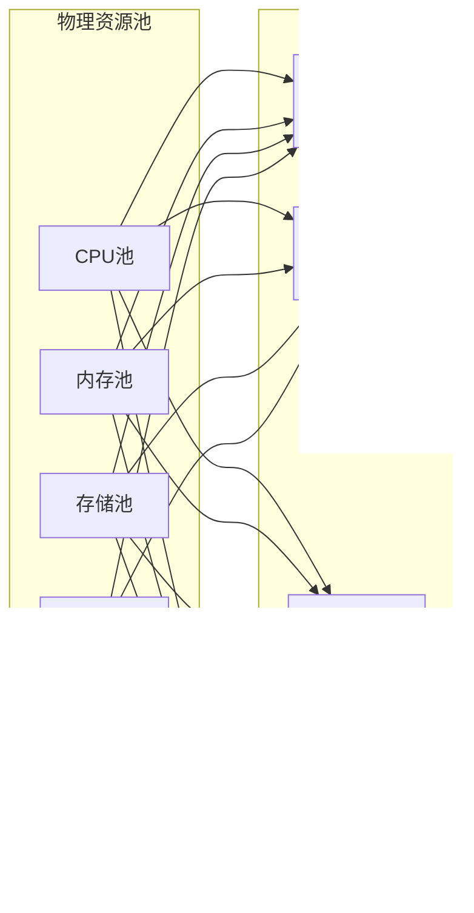
```mermaid
flowchart LR
  subgraph "物理资源池"
    CPU[CPU池]
    Memory[内存池]
    Storage[存储池]
    Connection[连接池]
  end

  subgraph "租户配额分配"
    T1[租户A<br/>4核8G]
    T2[租户B<br/>2核4G]
    T3[租户C<br/>8核16G]
    T4[租户D<br/>1核2G]
  end

  CPU --> T1
  CPU --> T2
  CPU --> T3
  CPU --> T4

  Memory --> T1
  Memory --> T2
  Memory --> T3
  Memory --> T4

  Storage --> T1
  Storage --> T2
  Storage --> T3
  Storage --> T4

  Connection --> T1
  Connection --> T2
  Connection --> T3
  Connection --> T4
```

---

## 六、观测面:可观测性

### 6.1 观测数据采集架构

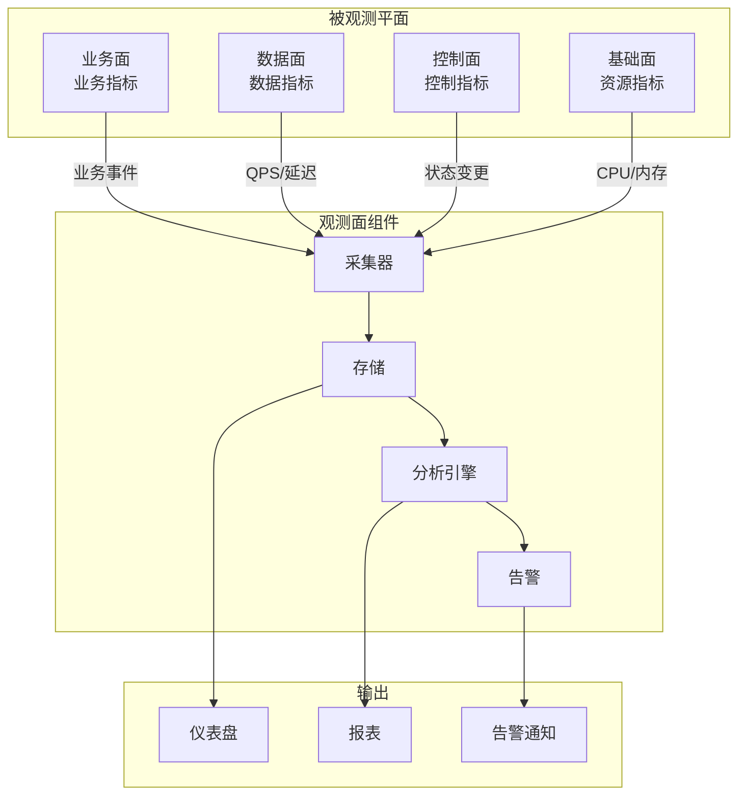
```mermaid
flowchart TB
  subgraph "观测面组件"
    Collector[采集器]
    Storage[存储]
    Analysis[分析引擎]
    Alert[告警]
  end

  subgraph "被观测平面"
    BIZ[业务面<br/>业务指标]
    DATA[数据面<br/>数据指标]
    CTRL[控制面<br/>控制指标]
    BASE[基础面<br/>资源指标]
  end

  subgraph "输出"
    Dashboard[仪表盘]
    Report[报表]
    AlertOut[告警通知]
  end

  BIZ -->|业务事件| Collector
  DATA -->|QPS/延迟| Collector
  CTRL -->|状态变更| Collector
  BASE -->|CPU/内存| Collector

  Collector --> Storage
  Storage --> Analysis
  Analysis --> Alert
  Storage --> Dashboard
  Analysis --> Report
  Alert --> AlertOut
```

### 6.2 租户维度指标

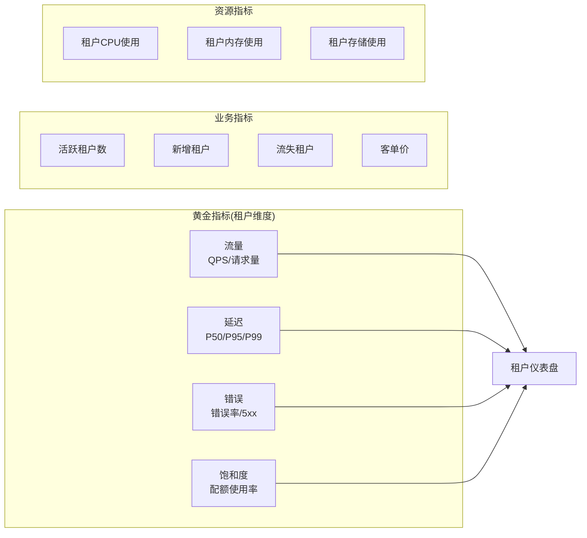
```mermaid
flowchart LR
  subgraph "黄金指标(租户维度)"
    LAT[延迟<br/>P50/P95/P99]
    TRA[流量<br/>QPS/请求量]
    ERR[错误<br/>错误率/5xx]
    SAT[饱和度<br/>配额使用率]
  end

  subgraph "业务指标"
    ACT[活跃租户数]
    NEW[新增租户]
    CHURN[流失租户]
    ARPU[客单价]
  end

  subgraph "资源指标"
    CPU_T[租户CPU使用]
    MEM_T[租户内存使用]
    STOR_T[租户存储使用]
  end

  TRA --> Dashboard[租户仪表盘]
  LAT --> Dashboard
  ERR --> Dashboard
  SAT --> Dashboard
```

### 6.3 告警规则配置

```yaml
# 观测面告警规则示例
alerts:
  - name: tenant_high_error_rate
    condition: rate(errors[5m]) / rate(requests[5m]) > 0.05
    severity: warning
    action: 通知租户运维人员

  - name: tenant_quota_exhausted
    condition: quota_usage / quota_limit > 0.9
    severity: critical
    action: 触发自动扩容流程

  - name: tenant_inactive
    condition: last_request_timestamp > 7d
    severity: info
    action: 发送续期提醒

  - name: cross_tenant_anomaly
    condition: user_tenant_count changes rapidly
    severity: high
    action: 安全告警+人工审核
```

---

## 七、安全面:安全机制

### 7.1 安全架构全景

```mermaid
flowchart TB
  subgraph C1["安全面组件"]
    Auth["认证服务"]
    RBAC["权限服务"]
    Audit["审计服务"]
  end

  subgraph L1["第一道防线:边界"]
    Gateway["安全网关"]
    WAF["WAF"]
  end

  subgraph L2["第二道防线:访问"]
    IAM["IAM/认证"]
    RBAC_Enf["权限执行"]
  end

  subgraph L3["第三道防线:数据"]
    RLS["行级安全"]
    Encrypt["加密"]
  end

  subgraph L4["第四道防线:审计"]
    Log["审计日志"]
  end

  L1 --> L2
  L2 --> L3
  L3 --> L4
```

### 7.2 租户安全边界

```mermaid
flowchart TB
  subgraph P1["请求入口"]
    C1["租户标识提取"]
    C2["防租户篡改"]
  end

  subgraph P2["服务调用"]
    C3["权限校验"]
    C4["配额检查"]
  end

  subgraph P3["数据访问"]
    C5["行级安全"]
    C6["缓存隔离"]
  end

  subgraph P4["输出响应"]
    C7["数据脱敏"]
    C8["统一错误码"]
  end

  P1 --> P2
  P2 --> P3
  P3 --> P4
```

### 7.3 跨租户授权模型

```mermaid
sequenceDiagram
  participant UA as 租户A用户
  participant App as 应用
  participant Auth as 认证服务
  participant subunit as 租户系统
  participant RBAC as 权限服务
  participant ResB as 租户B资源

  UA->>App: 请求访问租户B资源
  App->>Auth: verifyUser()
  Auth-->>App: JWT(tenant=A)

  App->>RBAC: checkCrossTenant()
  RBAC->>ResB: queryDelegation()
  ResB-->>RBAC: 授权记录有效

  RBAC-->>App: delegation_token
  App->>ResB: 请求+token
  ResB->>ResB: 验证+审计
  ResB-->>App: 返回数据
  App-->>UA: 响应
```

---

## 八、演进面:演进能力

### 8.1 演进能力框架

```mermaid
flowchart TB
  subgraph D1["数据演进"]
    Schema["Schema变更"]
    Migration["数据迁移"]
    Reshard["重新分片"]
  end

  subgraph D2["架构演进"]
    Decouple["服务解耦"]
    Scale["水平扩展"]
    MultiRegion["多地域"]
  end

  subgraph D3["配置演进"]
    Version["版本管理"]
    Gray["灰度发布"]
    Rollback["回滚能力"]
  end

  subgraph S["演进策略"]
    S1["向后兼容优先"]
    S2["双写过渡"]
  end
```

### 8.2 租户在线迁移流程

```mermaid
stateDiagram-v2
  [*] --> 准备

  准备 --> 双写

  双写 --> 切换

  切换 --> 清理

  清理 --> [*]
```

### 8.3 双层映射演进

```mermaid
flowchart TB
  subgraph BEFORE["演进前"]
    TA1["租户A"]
    LA1["逻辑分片1"]
    PA1["物理库1"]
    TA1 --> LA1 --> PA1
  end

  subgraph DURING["演进中"]
    TA2["租户A"]
    PA3["物理库3"]
    TA2 --> PA3
  end

  subgraph AFTER["演进后"]
    TA3["租户A"]
    LA3["逻辑分片3"]
    PA3_2["物理库3"]
    TA3 --> LA3 --> PA3_2
  end
```

---

## 九、七平面立体交互

### 9.1 租户创建场景的七平面协作

```mermaid
sequenceDiagram
  participant BIZ as 业务面
  participant CTRL as 控制面
  participant DATA as 数据面
  participant BASE as 基础面
  participant SEC as 安全面
  participant OBS as 观测面
  participant EVOL as 演进面

  BIZ->>SEC: 1. 认证用户权限
  SEC-->>BIZ: 授权通过

  BIZ->>CTRL: 2. 发起租户创建
  CTRL->>BIZ: 校验业务规则
  CTRL->>DATA: 分配租户ID

  DATA->>BASE: 3. 分配物理资源
  BASE-->>DATA: 资源就绪

  DATA->>BASE: 4. 创建数据库/Schema
  BASE-->>DATA: 创建完成

  CTRL->>EVOL: 5. 记录版本信息

  CTRL->>OBS: 6. 记录创建事件

  SEC->>BASE: 7. 写入安全策略

  CTRL-->>BIZ: 租户创建完成
  BIZ-->>BIZ: 返回结果
```

### 9.2 七平面立体架构图

```mermaid
flowchart TB
  subgraph TOP["顶层:业务面"]
    BIZ["租户业务逻辑"]
  end

  subgraph MID["中间层:核心能力"]
    CTRL["控制面"]
    DATA["数据面"]
  end

  subgraph BOT["底层:基础设施"]
    BASE["基础面"]
  end

  subgraph CROSS["贯穿层:横切关注点"]
    SEC["安全面"]
    OBS["观测面"]
    EVOL["演进面"]
  end

  BIZ <--> CTRL
  BIZ <--> DATA
  CTRL <--> BASE
  DATA <--> BASE
```

---

## 十、外部系统集成(以图书管理系统为例)

### 10.1 集成架构

```mermaid
flowchart TB
  subgraph "外部系统"
    LMS[图书管理系统]
  end

  subgraph "租户系统(MDD七平面)"
    BIZ[业务面]
    DATA[数据面]
    CTRL[控制面]
    BASE[基础面]
    SEC[安全面]
    OBS[观测面]
    EVOL[演进面]
  end

  subgraph "集成层"
    SDK[租户SDK]
    API[REST API]
  end

  LMS -->|调用| SDK
  LMS -->|调用| API
  SDK --> BIZ
  SDK --> SEC
  API --> BIZ
  API --> SEC
```

### 10.2 集成时序(七平面视图)

```mermaid
sequenceDiagram
  participant LMS as 图书管理系统
  participant SDK as 租户SDK
  participant SEC as 安全面
  participant BIZ as 业务面
  participant CTRL as 控制面
  participant DATA as 数据面
  participant OBS as 观测面

  LMS->>SDK: 请求图书列表
  SDK->>SEC: 租户认证
  SEC-->>SDK: tenant_id

  SDK->>SEC: 权限校验
  SEC-->>SDK: 通过

  SDK->>BIZ: 调用业务接口
  BIZ->>CTRL: 检查租户状态
  CTRL-->>BIZ: 运行中
  BIZ->>DATA: 查询数据
  DATA-->>BIZ: 返回(自动隔离)

  SDK->>OBS: 记录访问日志

  SDK-->>LMS: 返回结果
```

---

## 十一、MDD 方法论总结

### 11.1 七平面职责矩阵

| 平面 | 核心职责 | 租户系统对应内容 |
| --- | --- | --- |
| **业务面** | 定义业务逻辑 | 租户注册、套餐管理、生命周期、功能订阅 |
| **数据面** | 定义数据处理 | 数据隔离、路由、存储、扩展字段 |
| **控制面** | 定义控制逻辑 | 状态管理、容量调度、容量解析、决策执行 |
| **基础面** | 定义基础设施 | 计算、网络、存储、中间件 |
| **观测面** | 定义监控能力 | 指标、日志、链路、告警 |
| **安全面** | 定义安全机制 | 认证、授权、隔离、审计 |
| **演进面** | 定义演进能力 | 迁移、变更、版本、兼容 |

### 11.2 平面交互原则

```mermaid
flowchart LR
  subgraph "交互原则"
    P1[业务面驱动]
    P2[控制面协调]
    P3[数据面承载]
    P4[基础面支撑]
    P5[安全面贯穿]
    P6[观测面度量]
    P7[演进面保障]
  end
```

### 11.3 整体涌现特性

租户系统作为一个整体,展现出超越七平面简单叠加的特性:

| 涌现特性 | 来源平面 | 涌现机制 |
| --- | --- | --- |
| **租户隔离** | 安全面+数据面+基础面 | 多平面协同构建隔离边界 |
| **弹性伸缩** | 控制面+观测面+基础面 | 观测驱动控制,控制调整资源 |
| **按需定价** | 业务面+数据面+观测面 | 用量观测支撑业务计费 |
| **平滑演进** | 演进面+控制面+数据面 | 演进策略通过控制调度 |

---

这份报告按照 MDD 方法论的七平面结构,完整覆盖了租户系统的所有维度,并展示了平面之间的层次关系、交互网络和整体涌现特性。
